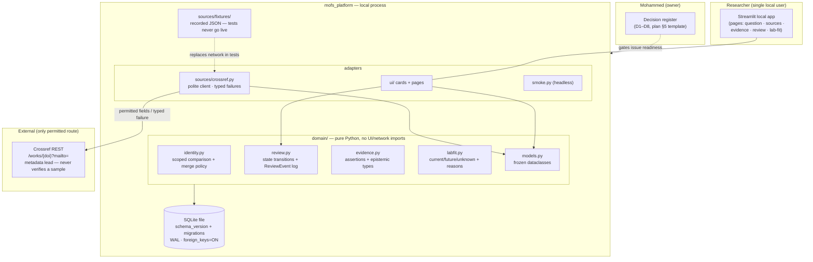
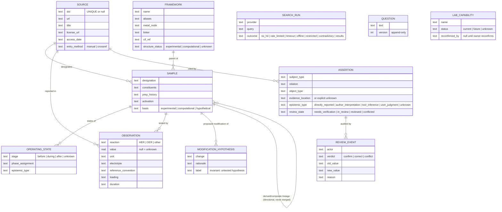
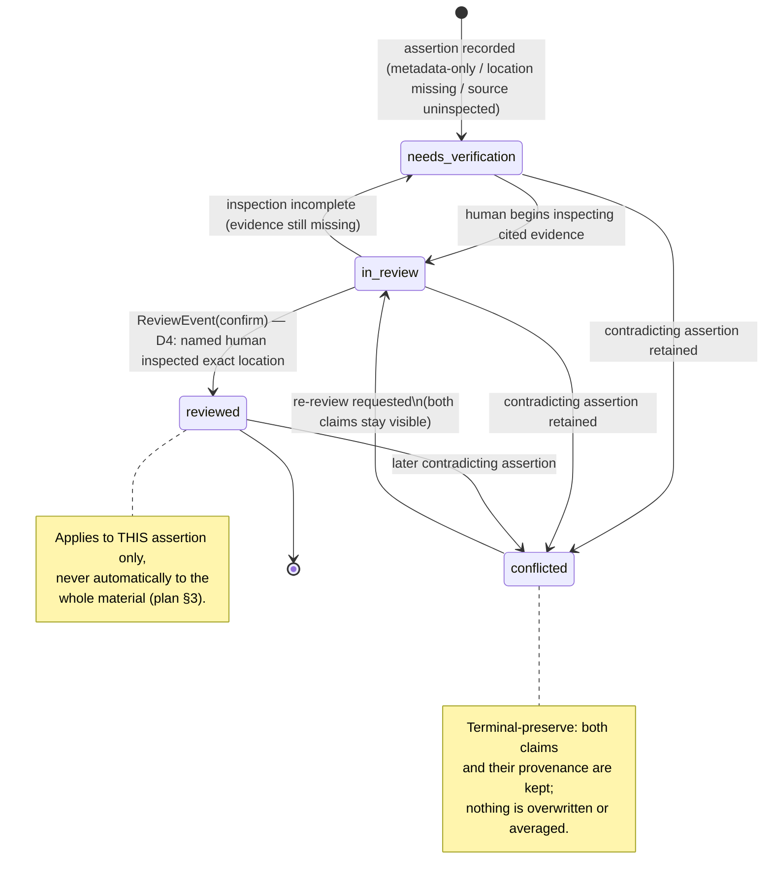
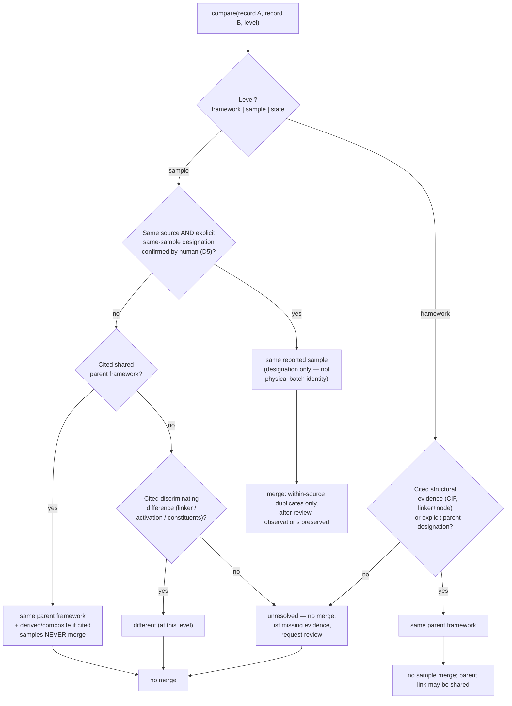

# How it fits together

A look under the hood for contributors and the curious: the layers, the data
model, the review lifecycle, and the identity comparison logic.

**Source of record:** these diagrams live in
[`_docs/proposals/diagrams.md`](https://github.com/m950m/MOFs_Platform/blob/main/_docs/proposals/diagrams.md)
in the repository; that file wins if the copies below ever drift. The four
diagrams shown here describe behavior the tool implements today. The proposal
file also contains a first-slice sequence diagram and a task-roadmap diagram —
historical proposal artifacts (issues #3–#13 are all delivered), so they are
not reproduced here to avoid presenting completed work as future plans.

## System context and layering

The app is a **local process**: a Streamlit UI talks to a pure-Python domain
core, which is the only writer of the SQLite evidence file. The single
external route is the Crossref REST API — a metadata lead that never verifies
a sample. In tests, recorded fixtures replace the network entirely.

**Reading rules:** arrows from `domain/` never point into `ui/`, `sources/`,
or Streamlit — the domain core is testable without a browser or network.
`session_state` is never evidence storage; all evidence flows through
`domain/` into SQLite.

## Core data model (the identity contract, as schema)

**Identity invariants encoded:** an observation points at exactly one
`SAMPLE` (never directly at a framework or an operating state); lineage
between samples is a directional *link*, never a merge; assertions carry
their own review state, so a status never spreads automatically to a whole
material.

## Assertion review lifecycle

## Identity comparison decision flow

The comparison logic behind
[Samples & identity](screens/samples-identity.md): **no path reaches "merge"
except the human-confirmed within-source, explicit-designation path** — a
shared name, formula, DOI, MOFid, or CIF alone can never arrive there.

