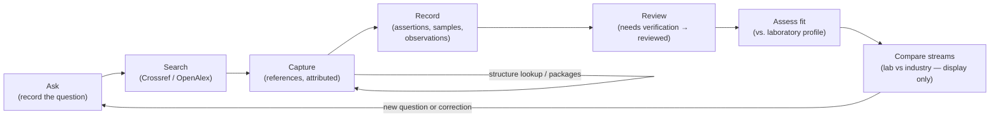

# Workflows — the daily loop

The tool is built around one repeating loop. Each turn of the loop leaves an
auditable trail; nothing silently changes behind your back.

## Ask — keep the question sharp

The saved question drives search queries and the per-criterion hit checks, so
it pays to keep it precise. The **Research question** screen shows
*consistency hints* and *mechanical observations* (vague wording, empty
fields) — review suggestions only, nothing is changed for you. When your
question changes, lab-fit assessments that were based on the old wording are
marked **outdated**; they cannot pretend to be current.

## Search — narrow, polite, recorded

Searches go to Crossref or OpenAlex with the exact query text recorded, one
polite page (8 hits) per run. Hits carry:

- HER / OER title-token checks — the two evidence streams stay separate;
- per-criterion checks against your question's hard requirements and
  preferences, each honestly shown as matched / not in title / `unknown`;
- hit order = provider retrieval order — **never a ranking**.

Widen the net by editing the query and running again. Capture hits you want to
follow; dismiss others with a recorded reason (the dismissal stays auditable).

## Capture — references are leads

Every reference — manually entered or captured from a hit or the structure
index — is a **lead**. Optional Crossref enrichment fills bibliographic fields
only; it never verifies a sample. Record *what was actually inspected*
(metadata / abstract / text) so a metadata-only lead cannot masquerade as a
read paper.

## Record — claims land attributed

- **Assertions** (Evidence screen): claim text exactly as reported, claim type
  (preparation / composition / property / application / other), evidence
  location or explicit `unknown`, extractor, epistemic type. A claim can be
  marked as **conflicting** with another — both stay visible.
- **Samples & observations** (Samples & identity): the reported tested sample
  as the source describes it, with observations attached to that sample only.
  The parent framework, a computational model, and the operating state during
  the reaction are recorded as *separate* records with their own provenance.
- **Relations**: when two records describe the same reported sample, the same
  parent, or a derived/composite relation, record the relation with its reason
  and evidence location. Relations link — they **never merge** records.

## Review — the honesty checkpoint

Reviewing is where `needs verification` claims become `reviewed` — and the
tool makes you show your work: reviewer, exact supporting source location, and
the reason. Corrections keep the old value in history with editor and reason;
reviewed claims that get corrected are stripped back to re-review. Resolving a
conflict is an explicit human decision, and both sides return to
`needs verification` afterwards.

## Assess fit — against *your* recorded laboratory profile

The **Laboratory profile** screen holds what your lab can do now, plans to do,
explicitly cannot do, or has unknown status — nothing is seeded and no
restriction is inferred from history. **Lab fit** compares a candidate's
sourced preparation and testing requirements against that profile and records
one of three outcomes with reasons:

- `possible with current capabilities`
- `requires future capabilities`
- `unknown`

No synthesis success and no catalytic performance is ever promised — the
assessment compares documented requirements with the documented profile, that
is all.

## Compare streams — laboratory vs industry, never merged

Laboratory-measured numbers and industry reference numbers (for example
electrolyzer targets you approved) are **separate streams**. The comparison
view displays them side by side with their provenance and conditions — it
never collapses them into one verdict, and conditions differences are shown,
never hidden.

## Along the way

- **Structure lookup** (Sources screen): import the CoRE MOF 2019 summary CSV
  you downloaded yourself, then search by name/formula/id. Structure records
  are provider metadata — capturing one's DOI creates a reference lead.
- **Evidence packages** (Sources screen): export selected sources and their
  dependents as one JSON file for a collaborator, or import theirs. Imports
  are strictly validated, enter as `needs_verification` attributed to the
  contributor, and are never merged with your records.
- **Compounds** (Candidates screen): group samples and structure records into
  a compound profile — manually, with a required identity note. Grouping is
  not equivalence and never merges; member values sit side by side.
